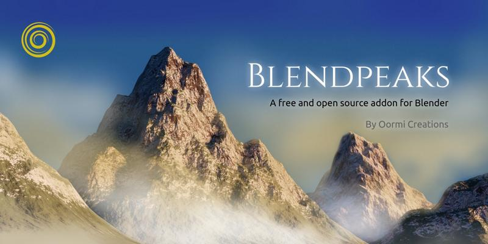
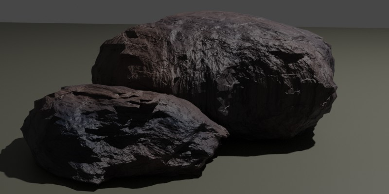

# Blendpeaks
A free and open source addon for Blender. It creates mountain peaks.

---

---

**Requirements**

* Blender 2.80 to 2.92 (_This addon was tested in Blender 2.82 2.90 2.92_)

**Features**

* Creates procedural mountain peaks in one click.
* Creates rocks.
* Easy to change parameters.
* Uses Cycles displacement.
* Bakes the height map in one click.

**Intro**

This very simple add-on generates models of mountain peaks with a procedural material. It also creates rocks.

**Intro Video**

https://www.youtube.com/watch?v=3-a7UdHuQIM

**Download and Installtion**

Download the Blendpeaks.py file from this repository. Or get the zip file from the releases page.
https://github.com/oormicreations/Blendpeaks/releases

Install from the Blender Menu > Edit > Preferences > Add-ons > Install. Pick the zip file Blendpeaks.zip. Enable this addon.
You will find the UI in the 3D View window when you press N.

Some versions of Blender may not show the UI or addon. Try installing the python file Blendpeaks.py directly after unzipping the zip.

**Usage**

Just click the **Create Peak** button!
Its done.

**Blendpeaks Panel**

**Divisions**: define the resolution of the geometry.

**Randomize**: sets up semi-random parameters for creation of a unique peak.

The following parameters can be adjusted anytime, before or after creation of the peak (Select the peak and change it).

**Height**: Changes the height. Also goes in negative to create pits.

**Seed**: Changes overall shape.

**Shape**: Defines gross shape.

**Shape Details**: Finer details.

**Ridges**: Changes the sharp edges on the peak.

**Ridges Details**: You can have more straight or random ridges.

**Erosion**: Creates eroded peaks with outcrops of rocks.

**Erosion Scale**: Scale of eroded features.

**Snow**: Adjust the amount of snow on the peak. It is angle dependent. Does on appear on steep slopes.

**Rock**: Adjust the amount of grass/rock material on the peak.

**Scale**: Scale the model along with the textures. You can also scale it as usual and later adjust the textures.

**Colors**: Change the colors as you wish. Or you can edit the shader directly.

**Bake Panel**

**Size**: Width and height of the image for height map.

**Switch to Eevee**: Switches to Eevee renderer immediately after baking the height map and applies it on the model.

**Bake Height Map**: Bakes a height map/displacement map for use in Eevee or in game engines etc.

**Rocks Panel**

**Divisions**: Number of divisions, or polys.

**Size**: Size of the rock.

**Height**: Height in z-direction (It is scaled)

**Shape**: Variation in shape.

**Shape Scale**: How tiny or big the features are.

**Smoothness**: More or less round shape.

**Details**: Like cracks and chips.

**Detail Scale**: Tiny or big cracks etc.

**Lava**: Frozen lava rock.

**Colors**: Change colors.

**Create Rock**: Create a rock.

**Misc Panel**

**Reset Defaults**: button will reset all parameters to default values. Else they remain stored in your blender file.

**Warning**: Reset Default will immediately affect the selected object. All your settings will be gone. Deselect the object if you need to create a new one.

**Help | Source | Updates**: brings you to this page on GitHub.

**Known Issues**

* If you have two peaks and you change the first, and select the second and try to change it, it gets all the parameters of first peak and the last setting is lost. This is because the other parameter remain in the UI, while you selected the second peak.
* Does not work in non-English versions yet.
* Sometimes it fails to save the baked texture file. Usually you can save it manually from Image Editor. Save it as OPEN EXR file with 32 bit depth. Ensure that you have saved the blender file before baking. Try starting from a clean new blender scene.
* **Always save your stuff!**

**Misc Info**

This plugin has been released under MIT license, which means it is free for any kind of use and modification, but has no warranties or liabilities. Please read the license before you download and use it. 

**About**

A FOSS Project by Oormi Creations.

http://oormi.in

A limited support is available via email.

oormicreations@gmail.com

Sep 2020.

